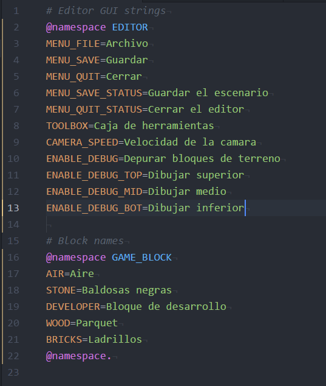

# Lang file

Language file is a type of localization file for a tiny Argochamber's language
parsing file.

### Directives

For definitions: `UPPERCASE_KEY=my custom string`

Namespace usage: `@namespace NAMESPACE_NAME`

Namespace nullify: `@namespace.`

Echo: `@echo my message`

Custom directive call: `@{directive_name} variadic, args`
